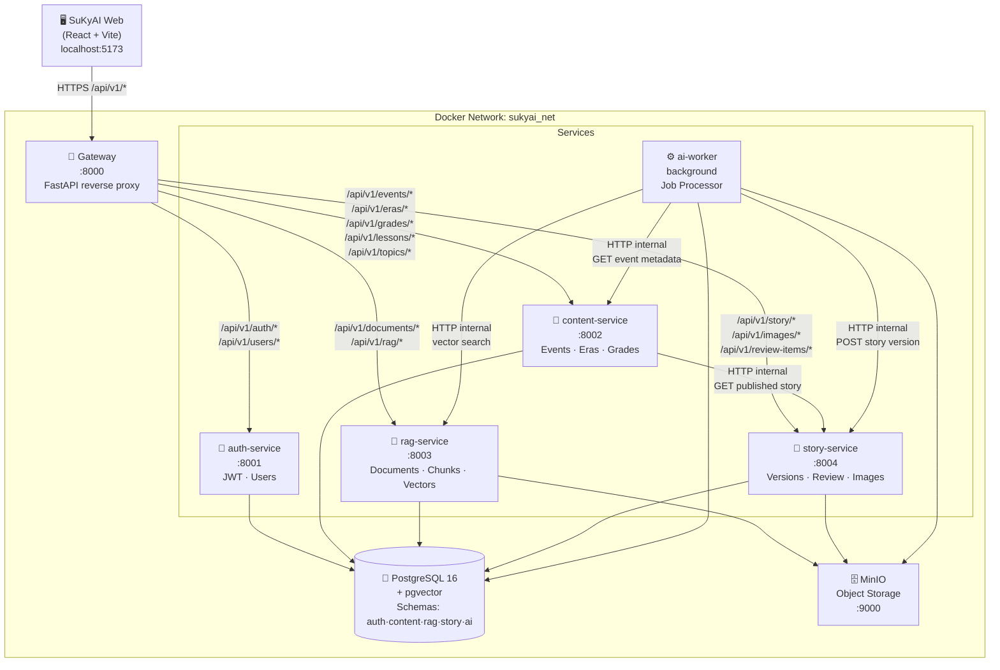
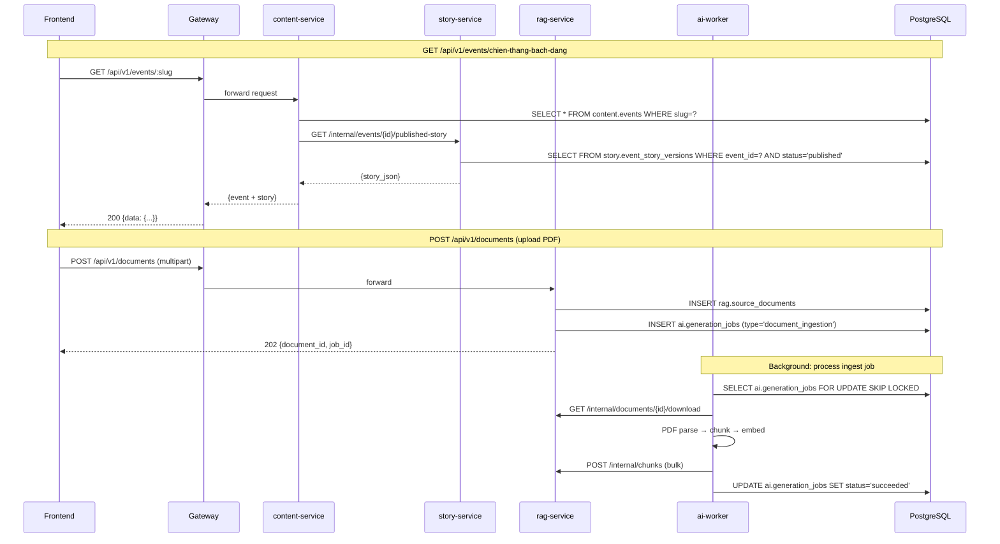
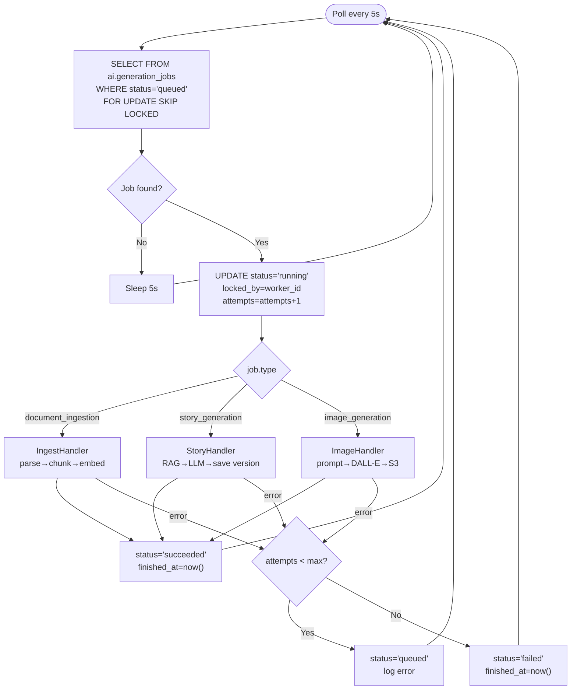

# SuKyAI Platform — Backend Microservices HLD

## Architecture Overview



---

## Service Responsibility Matrix

| Service | DB Schema | Port | Owns | Calls |
|---|---|---|---|---|
| `gateway` | — | 8000 (public) | Route table | All services |
| `auth-service` | `auth` | 8001 | users, audit_log | — |
| `content-service` | `content` | 8002 | eras, grades, lessons, topics, events, event_sources | story-service |
| `rag-service` | `rag` | 8003 | source_documents, document_chunks, chunk_embeddings | — |
| `story-service` | `story` | 8004 | event_story_versions, block_citations, image_assets, review_items | content-service, rag-service |
| `ai-worker` | `ai` | 8005 (optional) | generation_jobs | content, rag, story |

---

## Database Schema Ownership

```
PostgreSQL: sukyai
├── auth.*
│   ├── users
│   └── audit_log
├── content.*
│   ├── eras
│   ├── grades
│   ├── lessons
│   ├── topics
│   ├── events
│   ├── event_topics
│   ├── event_grades
│   ├── lesson_events
│   └── event_sources         ← UUID ref to rag.source_documents (no FK)
├── rag.*
│   ├── source_documents
│   ├── document_chunks
│   └── chunk_embeddings      ← vector(1024) via pgvector
├── story.*
│   ├── event_story_versions  ← UUID ref to content.events (no FK)
│   ├── block_citations       ← UUID ref to rag.document_chunks (no FK)
│   ├── image_assets
│   └── review_items
└── ai.*
    └── generation_jobs       ← UUID refs to all other schemas (no FK)
```

> **Cross-service FK rule**: No hard FK across schemas.
> UUID references are validated at application layer via internal HTTP calls.

---

## Internal Communication Pattern



---

## AI Worker Job Flow



---

## Gateway Route Table

| Prefix | Upstream |
|---|---|
| `/api/v1/auth` | `http://auth-service:8001` |
| `/api/v1/users` | `http://auth-service:8001` |
| `/api/v1/events` | `http://content-service:8002` |
| `/api/v1/eras` | `http://content-service:8002` |
| `/api/v1/grades` | `http://content-service:8002` |
| `/api/v1/lessons` | `http://content-service:8002` |
| `/api/v1/topics` | `http://content-service:8002` |
| `/api/v1/documents` | `http://rag-service:8003` |
| `/api/v1/rag` | `http://rag-service:8003` |
| `/api/v1/story` | `http://story-service:8004` |
| `/api/v1/images` | `http://story-service:8004` |
| `/api/v1/review-items` | `http://story-service:8004` |
| `/api/v1/ai` | `http://ai-worker:8005` |

---

## Health Endpoints

All services expose `GET /health`:

```json
{"status": "ok", "service": "auth-service"}
```

Check all services at once:
```bash
for svc in gateway auth-service content-service rag-service story-service; do
  curl -s http://localhost:$(docker port sukyai-$svc 8000/tcp | cut -d: -f2)/health
done
```

---

## Running Locally

```bash
# 1. Copy and configure env
cp .env.example .env

# 2. Start all services
docker compose up -d

# 3. Run migrations
docker compose exec auth-service alembic upgrade head

# 4. Check health
curl http://localhost:8000/health

# 5. View logs
docker compose logs -f ai-worker
```

---

## Migration Strategy (Phase 1)

One shared Alembic root (`alembic/`) managing all schemas.

Migration naming convention:
```
001_auth_users.py
002_auth_audit_log.py
003_content_eras_grades_topics.py
004_content_lessons.py
005_content_events.py
006_content_junctions.py
007_content_event_sources.py
008_rag_source_documents.py
009_rag_chunks_embeddings.py
010_story_versions_citations.py
011_story_images_review.py
012_ai_generation_jobs.py
```

Each migration prefixes tables with schema name:
```python
op.create_table("users", schema="auth", ...)
op.create_table("events", schema="content", ...)
```
