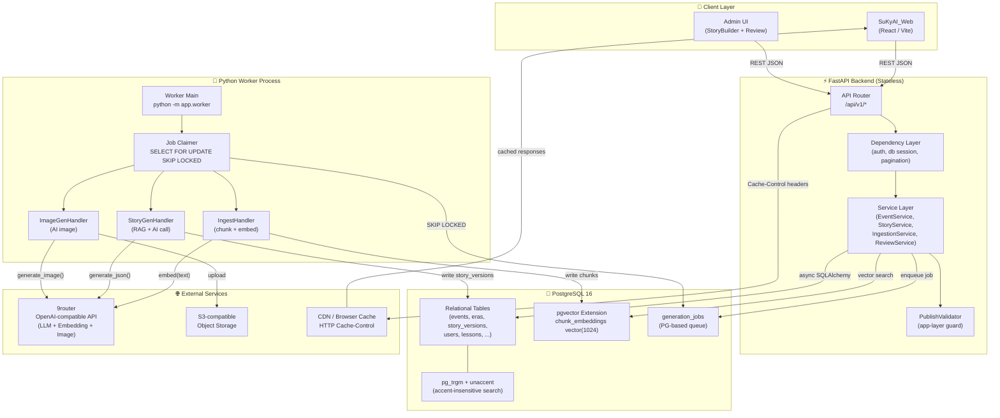
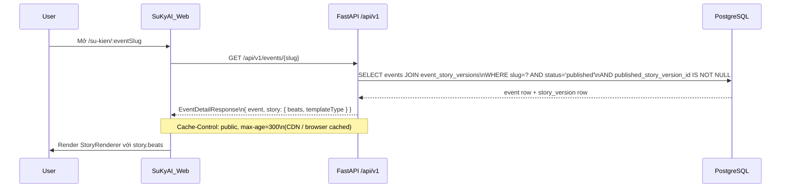
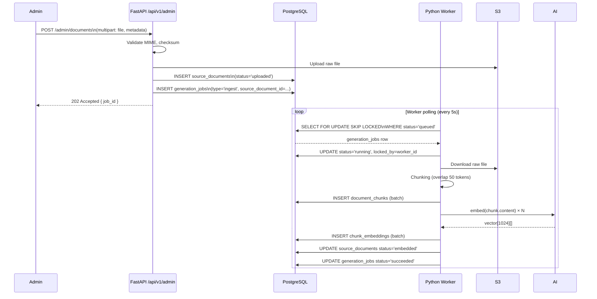
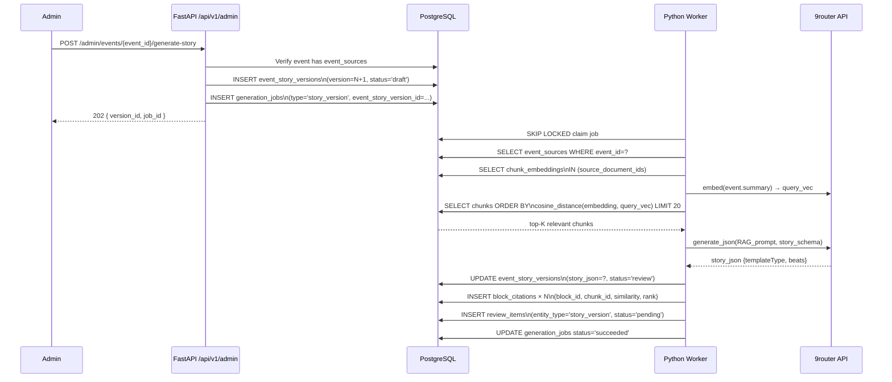
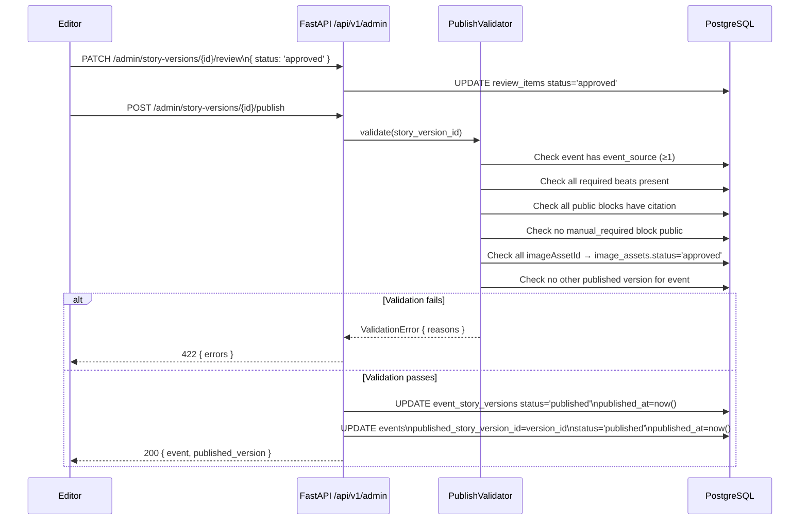

# High-Level Design — Sử Ký Toàn Thư AI Backend

> **Version**: 1.0 — Phase 1  
> **Author**: Backend Architecture Team  
> **Stack**: FastAPI · PostgreSQL 16 + pgvector · Python 3.11+  
> **Scope**: HLD, Data Flows, Non-Functional Requirements

---

## 1. System Overview

Sử Ký Toàn Thư AI là nền tảng trực quan hóa lịch sử Việt Nam cho học sinh từ cấp Tiểu học đến THPT. Hệ thống gồm các thành phần sau:

| Component | Role |
|---|---|
| **SuKyAI_Web** (React/Vite) | Frontend hiện tại — cinematic storytelling UI |
| **FastAPI Backend** | Stateless REST API — phục vụ public read, admin CRUD, job dispatch |
| **PostgreSQL 16 + pgvector** | Database chính: relational data + vector embeddings |
| **PostgreSQL-based Worker** | Process Python riêng, lấy job từ bảng `generation_jobs` |
| **9router AI Provider** | OpenAI-compatible adapter — text gen, embedding, image gen |
| **S3-compatible Object Storage** | Lưu tài liệu gốc, ảnh, audio (interface only ở Phase 1) |
| **CDN / HTTP Cache** | Browser & CDN cache thông qua `Cache-Control` headers; không Redis |

---

## 2. Architecture Diagram



---

## 3. Main Data Flows

### 3A — Public Read Flow

Người dùng mở trang Event Detail (không cần đăng nhập).



**Response shape** tương thích `event-queries.js`:
```json
{
  "id": "uuid",
  "slug": "bach-dang-938",
  "title": "Trận Bạch Đằng năm 938",
  "eraId": "uuid",
  "eraSlug": "nha-ngo",
  "year": 938,
  "gradeTags": ["THCS", "THPT"],
  "topics": ["thuy-chien"],
  "type": "battle",
  "featured": true,
  "summary": "...",
  "excerpt": "...",
  "image": "...",
  "story": {
    "templateType": "battle",
    "beats": [...]
  }
}
```

---

### 3B — Admin Ingestion Flow

Admin upload tài liệu `.md`/`.txt` để worker chunking + embedding.



---

### 3C — Story Generation Flow

Admin trigger sinh story từ event + event_sources.



---

### 3D — Review / Publish Flow

Admin/editor review và publish story version.



---

## 4. Non-Functional Requirements

| Category | Requirement |
|---|---|
| **Statelessness** | FastAPI backend không giữ session/state trong bộ nhớ. Auth bằng JWT Bearer token. |
| **Queue** | PostgreSQL-based queue đủ cho Phase 1 (< 100 jobs/day). `SELECT FOR UPDATE SKIP LOCKED` prevents double-claim. |
| **Caching** | `Cache-Control: public, max-age=300` cho public endpoints. Không Redis ở Phase 1. |
| **Soft Delete** | Tất cả entity chính có `deleted_at` + `deleted_by`. Query mặc định lọc `WHERE deleted_at IS NULL`. |
| **Audit Log** | Mọi action write vào bảng `audit_log` (actor, action, entity_type, entity_id, diff). |
| **Anti-hallucination** | Mọi block AI-generated phải có ít nhất 1 `block_citation`. `PublishValidator` từ chối nếu thiếu. |
| **No AI auto-publish** | AI không được set `featured=true`. Worker luôn set `status='review'`. Publish phải do human. |
| **Secrets** | Tất cả credential (API key, DB URL) lấy từ env vars. Không hardcode. |
| **Vietnamese Search** | `pg_trgm` GIN index trên `normalized_search_text`. Normalize tại app layer (unaccent + lowercase + đ→d). |
| **Frontend Compat** | Response shape khớp với helper contracts trong `event-queries.js`. Swap mock → API không đổi component. |
| **Error Format** | `{ "detail": "...", "code": "ERR_CODE" }` consistent. |
| **Pagination** | Cursor-based (keyset) cho listing endpoints. Không offset lớn. |

---

## 5. AI Provider Interface

```python
class AIProviderClient:
    """Adapter cho 9router OpenAI-compatible API.
    Config từ env vars: NINEROUTER_API_KEY, NINEROUTER_BASE_URL,
    LLM_MODEL, EMBEDDING_MODEL, IMAGE_MODEL.
    """

    async def generate_json(self, prompt: str, schema: dict) -> dict: ...
    async def generate_text(self, prompt: str) -> str: ...
    async def generate_image(self, prompt: str) -> str: ...  # returns storage URL
    async def embed(self, text: str) -> list[float]: ...      # 1024-dim
    async def health_check(self) -> bool: ...
```

**Env vars required:**
```
NINEROUTER_API_KEY=...
NINEROUTER_BASE_URL=https://...
LLM_MODEL=...
EMBEDDING_MODEL=intfloat/multilingual-e5-large
IMAGE_MODEL=...
```

---

## 6. Storage Interface (Phase 1 — Design Only)

```python
class StorageClient:
    async def upload(self, key: str, data: bytes, content_type: str) -> str: ...
    async def download(self, key: str) -> bytes: ...
    async def get_presigned_url(self, key: str, expires: int = 3600) -> str: ...
    async def delete(self, key: str) -> None: ...
```

Config từ env:
```
S3_BUCKET=suky-ai
S3_ENDPOINT_URL=...
S3_ACCESS_KEY=...
S3_SECRET_KEY=...
```

---

## 7. Vietnamese Accent-Insensitive Search

### Normalize function (app layer)
```python
import unicodedata
import re

def normalize_vietnamese(text: str) -> str:
    """Lowercase, remove diacritics, đ→d, collapse whitespace."""
    text = text.lower()
    text = text.replace('đ', 'd').replace('Đ', 'd')
    # NFD decompose → strip combining marks
    text = unicodedata.normalize('NFD', text)
    text = re.sub(r'[\u0300-\u036f]', '', text)
    text = re.sub(r'\s+', ' ', text).strip()
    return text
```

### DB Index
```sql
CREATE INDEX idx_events_normalized_search ON events
USING GIN (normalized_search_text gin_trgm_ops);
```

### Search query
```sql
SELECT * FROM events
WHERE normalized_search_text ILIKE '%' || :q_normalized || '%'
  OR similarity(normalized_search_text, :q_normalized) > 0.3
ORDER BY similarity(normalized_search_text, :q_normalized) DESC
LIMIT :limit;
```

---

## 8. PostgreSQL-based Worker

### Job Claim Logic
```sql
-- Atomic claim với SKIP LOCKED (không block concurrent workers)
WITH claimed AS (
    SELECT id FROM generation_jobs
    WHERE status = 'queued'
      AND (locked_at IS NULL OR locked_at < now() - INTERVAL '10 minutes')
    ORDER BY queued_at
    LIMIT 1
    FOR UPDATE SKIP LOCKED
)
UPDATE generation_jobs
SET status    = 'running',
    locked_by = :worker_id,
    locked_at = now(),
    started_at = now(),
    attempts  = attempts + 1
FROM claimed
WHERE generation_jobs.id = claimed.id
RETURNING *;
```

### On Success
```sql
UPDATE generation_jobs
SET status      = 'succeeded',
    finished_at = now(),
    output      = :output_jsonb
WHERE id = :job_id;
```

### On Failure
```sql
UPDATE generation_jobs
SET status      = CASE WHEN attempts < max_attempts THEN 'queued' ELSE 'failed' END,
    finished_at = CASE WHEN attempts >= max_attempts THEN now() ELSE NULL END,
    error       = :error_message,
    locked_by   = NULL,
    locked_at   = NULL
WHERE id = :job_id;
```
